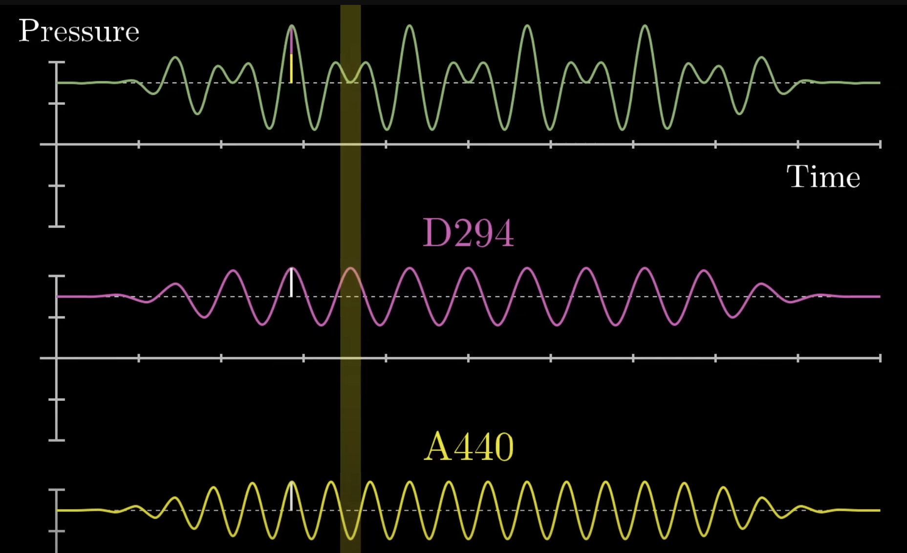

# Fast Fourier Transforms

A fast fourier transform efficiently calculates the Discrete Fourier Transform (DFT) of a signal or it's inverse.

Typical example is decomposing frequencies from sound. The top

- Wrap these frequencies around a circle
- using eulers formula for calculating distance on a unit circle (e^ix)

resources:
https://www.youtube.com/watch?v=spUNpyF58BY
