# HONK

Honk is short for hyper optimised PLONK.

### Programs to Arithmetic conversion

We can express programs as arithmetic circuits.

The simplest form of a constraint is

$$ A \cdot B + C = 0 $$

A, B and C are wires carrying values. The arithmetic operations (\* and +) are referred to as gates.

We want to transform these algebraic constraints into bounded degree polynomials

### Plonkish Arithmetisation

Arithmetisation is 2 steps:

- generate the execution trace and polynomial constraints
- transform both of these into a single low degree polynomial

Plonks base constraint system is written as:

$$ q_M \cdot w_1 \cdot w_2 + q_L \cdot w_1 + q_R \cdot w_2 + q_O \cdot w_3 + q_C = 0 $$

$ q\_{M'}, q\_{L'}, q\_{R'}, q\_{O} $ and $ q_C $

while $w_i$ are our witness values

#### Plonk Arithmetisation Example

Example: prover knows $ a $ such that $ b - 1 = a^2 $

Arithmetic Circuit:

```mermaid
graph TD
    A[a] --> C[x]
    A[a] --> C[x]
    C[x] -->|a²| F[b]
    D[add] -->  F[b]
```

### Sources

this aztec doc:
https://docs.google.com/presentation/d/19p1QrsNpOwTX8HdB_pS2egN4TFuA7vBUvOuwudFZF9E/edit?slide=id.g314512a3779_0_119#slide=id.g314512a3779_0_119
